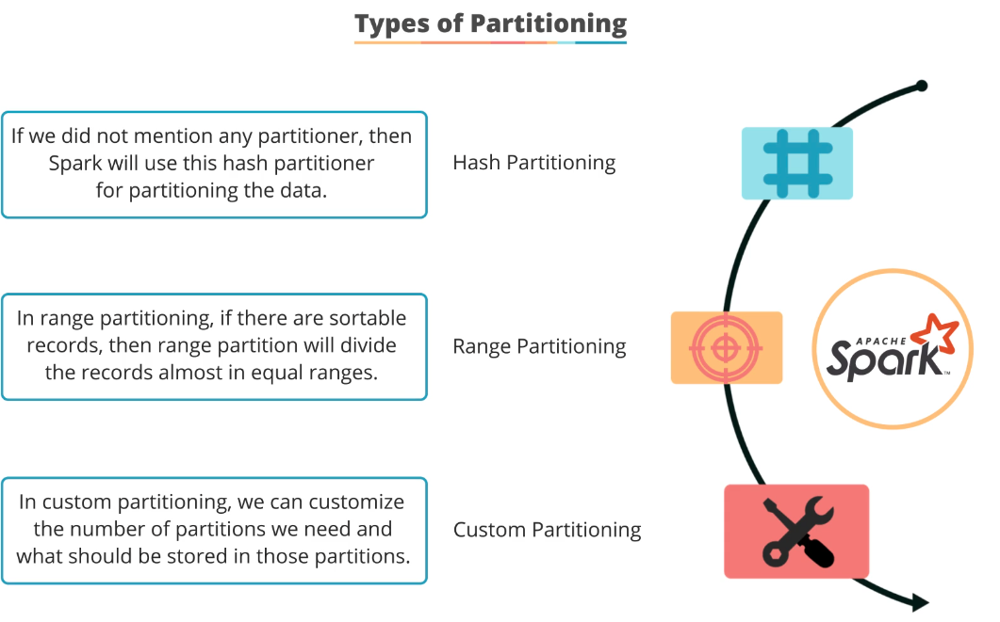

## Resilient Distributed Datasets (RDDs) ##
1. First API that Spark came out with in Spark v1 and though superseded still needed from time to time.

1. Still core and legacy Spark implementation may still use RDD. Newer approaches use DataFrames and DataSets.

1. RDD - a bunch of **data** arranged into rows that is **distributed** across different computers, **resiliently** managed by Spark to ensure they are being run.

1. Use the `SparkContext`(sc) object as the starting point of creating a RDD, which will care of the resiliency and distribution for you.

1. Create a sc object using these methods:
- using a `List` object
- load from a file storage, s3 or HDFS - sc.textFile ("file:///...") or s3n:// or hdfs://
- using Hive - `hiveCtx = HiveContext(sc)`
- from JDBC, Cassandra, HBase, ElasticSearch, any structued format sources - JSON, CSV and compressed formats

6. Many RDD methods accept a *function* as a parameter.

1. To perform useful stuff on your RDD, you need to perform certain actions on it, e.g. `collect`, `reduce`, `countByValue` etc. Nothing will happen in your driver script or program until an action is called!

1. High level steps to get a RDD to work are:
- import the right packages `org.apache.spark._`
- create the `SparkContext`
- create the RDD (in the example for **RatingsCounter.scala**, it loaded from a file)
- perform an necessary extract and transform from the RDD, e.g. map() to obtain the necessary intermediate RDD
- perform the necessary RDD actions, like `collect()`,`reduce()`, `count()` etc. NOTE: this action also makes us leave the Spark land and obtain the results back into our driver script / program; this step NO LONGER returns a RDD
- sort or print etc on the result as necessary

9. Under the hood, Spark looks at the code to be executed and derives an execution plan: parallelize the map() operations in its own executor thread; the countByValue() is prob hardly to parallelize hence this is in his own executor thread. The sort and print is in its own executor thread.

1. RDD can also be maps and not just confined to list. And there are associated methods / actions with manipulating RDD maps.

1. Often, we use this technique: `rdd.mapValues(x => (x,1))` to assign a value of 1 to every key. This allows us to sum the totals for a given key later easily using the reduceByKey() function.
- for a given key-value tuple like (33, 385), `mapValues(x => (x, 1))` gives (33, (385, 1))

12. Caching and Persistence in RDD:  

- Allows storage and reuse of RDD partitions
- Enables automatic recomputation of lost RDD partitions
- Leverage different storage levels for peristence of RDD
- Use methods `cache()` or `persist()` to invoke these; using `cache()` - storage level is **MEMORY_ONLY**, whereas `persist()` will use different storage levels (see below)

13. Storage levels in Spark:  

- MEMORY_ONLY: stored as de-serialised Java objects in JVM memory; partitions may not be cached if memory don't fit the partitions;
- MEMORY_AND_DISK: same as above but if JVM memory don't fit, the partitiions are stored on disk and read from them as needed;
- MEMORY_ONLY_SER: stored a serialized Java objects in JVM memory and takes less space than de-serialised objects;
- MEMORY_AND_DISK_SER: same as MEMORY_ONLY_SER where those that don't fit into memoery are spilled onto disk;
- DISK_ONLY: everything is stored on disk only; uses less storage space and higher CPU computation is not necessary;
- OFF_HEAP: similar to MEMORY_ONLY_SER with the difference using off off heap to store data and requires off heap to be enabled;

14. Partitioning in Spark:  
  

---