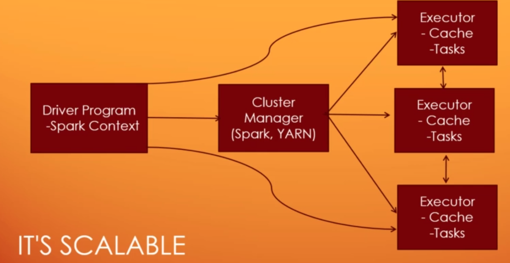

# All about Apache Spark #  
This repo contains all the learnings to get started wit Apache Spark.
The information and coding examples also assumes you have basic fundamentals on using an IDE (such as IntelliJ) and Scala programming.

## Introduction to Spark ##
1. *"A fast and general engine for large scale data processing"*.  
You tell what transformation and analysis you want to do in a script and Spark will figure out how to paralleize the work for you across the cluster, using the individual machines supporting the cluster to do it.

1. Spark can run standalone and does not necessarily need a hadoop cluster to back it.

1. 100x faster than Hadoop MapReduce using DAG (direct acyclic graph) techniques. Spark is memory based hence it is also faster.

Architecture overview:  

---
