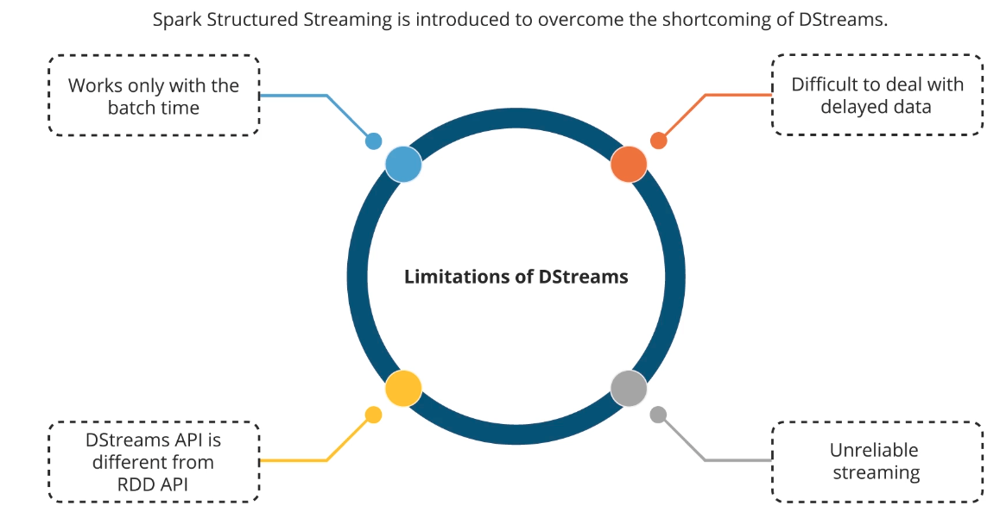

## Spark Streaming Introduction ##
1. Real time data that needs to be analysed on the fly.

1. A typical real-time data processing paradigm / lifecycle is depicted below:  


### Overview ###
1. Common example: analysing and processing log data from a website or a server.

1. Data is aggregrated and analyzed at some given interval.

1. Can take from some port, Amazon Kinesis, HDFS, Kafka, Flume and others.

1. Has "checkpointing" feature whereby if the cluster goes down while streaming, we can resume from where it stopped:
- Stores state to disk periodically for fault tolerance.

### Discretized Stream - Dstream API ###
1. Legacy object Dstream uses the concept of micro-batches, say batching up data in 1 sec interval and then processes them via distinct RDDs. This is now being replaced by more modern streaming APIs.
- Characterized by a series of RDDs
- Can work with these are the types of sources:  

- Leverages "windowed operations" that can analyse and combine results from different batches over a sliding time window;
- E.g. `window()`, `reduceByWindow()`, `reduceByKeyAndWindow()`
- Use `updateStateByKey()` to maintain a state across many batches as time goes on
- Use `StreamingContext()` instead of `SparkContext()` for using Spark Streaming.
- This diagram shows how this works behind the scene  


2. Limitations of DStream API:  
  

### Structured Streaming ###
1. Introduced in Spark 2.  
  

1. Uses DataSets as its primary API; a DataSet that keeps appending and we can query it whenever you like.  

1. Realtime and not based on "micro-batches".

1. This summarises the advantages of using structured streaming over DStream:  
  

1. Stream your parsed and analysed outputs to a console, database or whatever you want.

1. Uses the same `SparkSession` object to initialize the same session.

1. Then use `readStream()` instead of **read()** to process the input data such as logs:
```
  val accessLines = spark.readStream.text("data/logs")
```
And send the output to a console like this:
```
val query = statusCountsDF.writeStream.outputMode("complete").format("console").queryName("counts").start()
```

7. Structured Streaming appends new data onto the target table and developers only need to work with the target table and defining triggers on when to process the data:  
  

1. Whenever a trigger is activated or when new data gets appended, the developers will execute a query against the target table as if querying the whole dataset. But under the hood, only incremental queries are being executed for those new arrived data. The same results are returned and written to output (depending on the specified mode)  
  

1. This summarises the components that make up structured streaming:  
  

1. The output modes are `append`, `complete` & `update`:  
  


1. A "Windowed" operation looks back over some period of time; **Slide interval** defines how often we eval a window period by sliding using the interval. The following diagram illustrates this:
  
The window is the period you are aggregrating stuff; while the slide interval is how often you are evaluating that window.
---

### Intro to GraphX ###
1. Graph APIs in Spark; dated and not much development and is based on the old RDD APIs.

1. GraphX is a system for graph-parallel computation.

1. `GraphFrames` is up and coming but not primetime yet as of now (Jul 2021).

1. Only useful for certain use cases:
- Measuring "connectedness", degree distribution, average path length, triangle counts --> high measures of typical graph network;
- Applying PageRank algo;
- Joining graphs together and transform graphs quickly;
- Supports `Pregel API` for transversing a graph;
- **CAN'T DO" solving our degrees of separation problem for a network; use `Pregel API` for fulfilling this need.
---